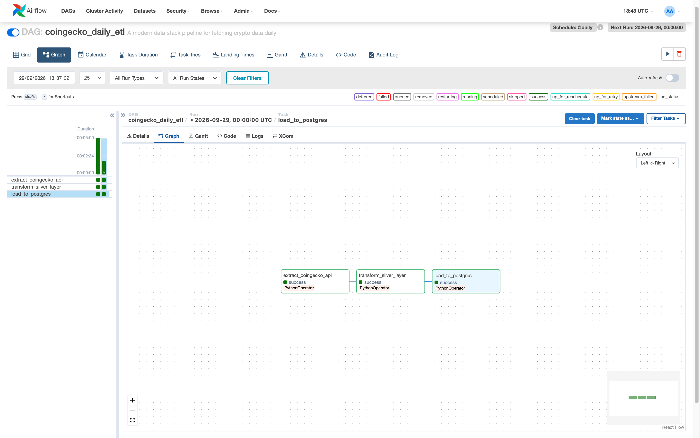
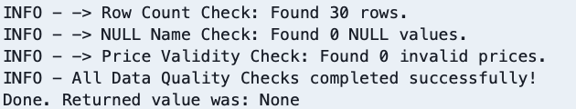

# Modern Data Stack (MDS) Crypto Pipeline

An automated, end to end data pipeline built to ingest, process, validate, and store cryptocurrency market data. This project implements a **Medallion Architecture (Bronze, Silver, Gold layers)** and is fully containerized and orchestrated using Apache Airflow and Docker.

---

## Architecture & Data Flow

The pipeline follows a modern analytical storage pattern, transforming raw API payloads into structured relational tables:

1. **Extraction (Bronze Layer)**: Fetches real-time market data from the CoinGecko API and persists raw JSON payloads.
2. **Transformation (Silver Layer)**: Processes raw data using **Pandas**, handling schema normalization, cleaning, and exporting optimized **Parquet** files.
3. **Loading (Gold Layer)**: Loads cleaned tabular data into a **PostgreSQL** relational database via **SQLAlchemy**.
4. **Data Quality & Validation**: Executes automated SQL assertions post-load to verify row counts, check for null constraints, and validate business rules (e.g., positive price checks).

---

## Tech Stack

* **Orchestration**: Apache Airflow
* **Containerization**: Docker, Docker Compose
* **Data Processing & Storage**: Python, Pandas, PyArrow, PostgreSQL, SQLAlchemy, Psycopg2
* **API Integration**: CoinGecko API (REST)
* **Version Control**: Git & GitHub

---

## Project Structure

```text
modern-data-stack/
│
├── dags/
│   └── coingecko_etl_dag.py        # Main Airflow DAG orchestrating the pipeline
├── data/
│   ├── bronze/                     # Raw JSON data storage
│   └── silver/                     # Cleansed Parquet files storage
├── logs/                           # Airflow execution logs
├── scripts/
│   ├── extract.py                  # API extraction script (Bronze Layer)
│   ├── transform.py                # Data cleaning & Parquet conversion (Silver Layer)
│   ├── load.py                     # Database loader using SQLAlchemy (Gold Layer)
│   └── quality_check.py            # Automated data quality assertions & constraints
├── .env                            # Environment variables (Ignored by Git)
├── .gitignore                      # Git exclusion rules
├── docker-compose.yaml             # Infrastructure orchestration
├── Dockerfile                      # Custom Airflow container image
├── LICENSE                         # Project license
├── README.md                       # Project documentation
└── requirements.txt                # Python dependencies

---
## Pipeline Execution Result


